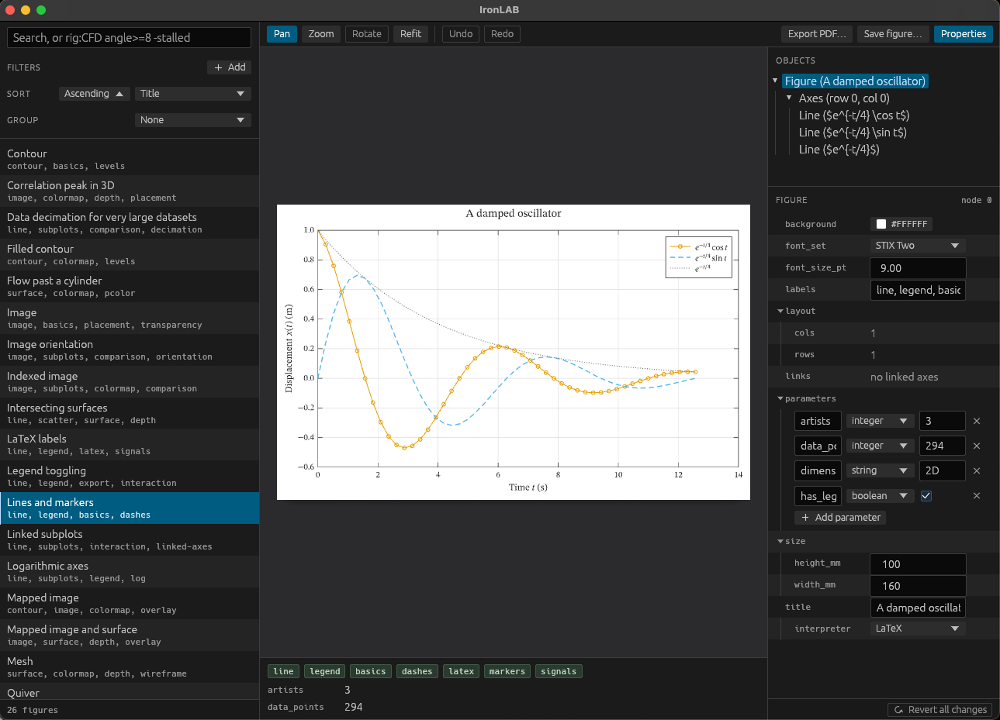

# IronLAB

IronLAB is a Rust library and application for building scientific figures, exploring them interactively then exporting them for publication.

IronLAB features:

- **A desktop viewer.** A fast, native application with [figure browser](guides/viewer.md#the-figure-browser) (*so you can find what you're looking for among hundreds of figures*) and [property editor](guides/viewer.md#the-property-editor) (*so you can edit what it looks like before exporting*). 

- **Web embeds.** Figures can be [embedded live in a web page](guides/embedding.md). Check out [the gallery](https://ironlab.org/gallery/) to see this in action!

- **Publication-quality PDF export.** A figure is exported as a PDF. That PDF is the exact size you need. It contains exactly what you're seeing (WYSIWYG). The fonts are the exact size you need. Figures, including all text and symbols, look identical wherever they're viewed. (*Yes, figures can also be exported as pngs!*).

- **Embedded LaTeX mathematics.** Any label, tick, or title may contain a LaTeX expression, which IronLAB typesets itself using the awesome latex-rust project: no TeX installation is needed to build, view, embed or export a figure.

- **Smart vector/raster export.** All exports contain entirely vector graphics - no more screenshots (finally!!!). If the contents get too large (complex surfaces or images could result in massive PDF files), individual objects are rasterised at 600dpi (retaining vectorised axes, labels and everything else). 

- **Language clients.** (COMING SOON!) Write figures from a wide variety of languages like python, MATLAB, C++, julia and more. Reach out on [github](https://github.com/thclark/ironlab) to request a client if it's not there yet, we'll build them only in response to demand.


<figure>
  
  <figcaption>The IronLAB desktop viewer. The figure browser on the left lists a collection of figures with their labels; the selected figure is drawn in the centre, with its labels and parameters beneath it; and the property editor on the right shows the figure's objects and the properties of the selected one.</figcaption>
</figure>


## At the core

IronLAB is built on a unified data model that describes the contents and arrangement of a figure. This is a tree of nodes (like the figure, its axes and their contents).

These nodes are strictly defined by Rust types. Other languages can read and write figures through `.proto` files generated from the types. Figures are held in binary form using Protocol Buffers (lowest memory, fastest), or as JSON (less efficient, but user-readable).

This yields us the following benefits:
- Anyone (now or at any time in the future) can build or read an IronLAB figure, even without using IronLAB at all - it's a completely public, open data model
- Every node has a stable identifier, and every property that affects the drawing is stored in the model, so a saved figure reopens exactly as it was built, whatever the platform.
- Property changes may be recorded as a changelist, meaning it is possible to 'undo/redo' any manipulation of the view.


## A minimal example

The IronLAB API takes inspriation from MATLAB, plotly, matplotlib and GNU/Octave plots. The [equivalent functions](reference/equivalent-functions.md) page lists every plotting function beside its MATLAB, matplotlib and Plotly counterparts.

The following program plots two curves with LaTeX legend entries and axis labels, exports the figure to PDF and opens it in the viewer.

```rust
use ironlab::prelude::*;

fn main() -> Result<(), ironlab::Error> {
    let x = linspace(0.0, 2.0 * std::f64::consts::PI, 200);
    let sin: Vec<f64> = x.iter().map(|x| x.sin()).collect();
    let cos: Vec<f64> = x.iter().map(|x| x.cos()).collect();

    let mut fig = Figure::new().size_mm(120.0, 80.0).title("Trigonometric functions");
    let mut ax = fig.axes(0, 0);
    ax.plot(&x, &sin).display_name("$\\sin x$");
    ax.plot(&x, &cos).display_name("$\\cos x$").dash(Dash::Dashed);
    ax.xlabel("$x$").ylabel("$f(x)$").legend(LegendLocation::NorthEast);

    fig.export_pdf("trigonometric.pdf")?;
    fig.show()
}
```

The [getting started guide](guides/getting-started.md) explains each step and every supported plot type.

## Map of the documentation

- **Guides** explain how to use IronLAB.
    - [Getting started](guides/getting-started.md) covers building figures with the Rust API, saving and loading them, exporting PDF for LaTeX documents and PNG for slides and web pages, and opening the viewer.
    - [Using the viewer](guides/viewer.md) describes the viewer's tools, gestures and keyboard shortcuts, and how to edit a figure live in its property editor.
    - [Embedding figures in a web page](guides/embedding.md) explains how a publication or a site carries a live figure, with the bundle, the element, its API and its theming.
- **[Gallery](gallery/index.md)** shows every example figure live in the page, with the exact source code that produced it.
- **Reference** describes the system precisely.
    - [Equivalent functions](reference/equivalent-functions.md) maps the plotting functions of MATLAB, matplotlib and Plotly to IronLAB's.
    - [Figure schema](reference/figure-schema.md) explains every entity of the figure model, its Protocol Buffers and JSON encodings, and the rules for versioning it.
    - [Architecture](reference/architecture.md) describes the crates, how a figure becomes pixels or a PDF page, and how text is resolved.
- **[Architecture decisions](adrs/index.md)** records the significant design decisions and the reasons for them.
- **[Background](background/index.md)** contains the discussion from which the design emerged.
- **Conventions** describe how the project is developed: [branching](conventions/git-branching.md), [commits and versioning](conventions/git-commits-and-versioning.md) and [pull requests](conventions/git-pull-requests.md). The [contributing guide](https://github.com/thclark/ironlab/blob/main/CONTRIBUTING.md) sets out how contributions are licensed.
